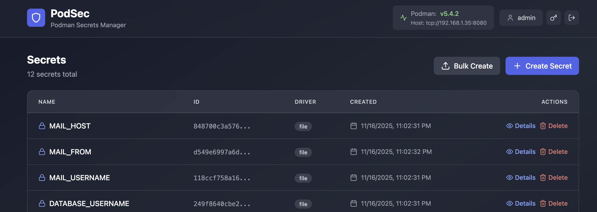

# PodSec - Podman Secrets Manager

Web-based management interface for Podman secrets with JWT authentication. Built with FastAPI and React.



## Prerequisites

- Podman 4.0+
- Python 3.11+
- Node.js 18+

## Installation

**Backend:**
```bash
cd backend
python -m venv venv
source venv/bin/activate
pip install -r requirements.txt
python -m uvicorn main:app --host 0.0.0.0 --port 8000 --reload
```

**Frontend:**
```bash
cd frontend
npm install
npm run dev
```

**Default Credentials:** Username: `admin`, Password: `admin` (Change immediately after first login)

## Configuration

Create `backend/.env` file:
```bash
# Podman connection (optional, defaults to local socket)
PODMAN_HOST=tcp://your-podman-host:8080

# JWT secret key (required for production)
SECRET_KEY=your-random-secret-key-here

# Database (optional, defaults to sqlite:///./podsec.db)
DATABASE_URL=sqlite:///./podsec.db
```

**Start Podman API Service (for remote access):**

Option 1 - Temporary:
```bash
podman system service --time=0 tcp:0.0.0.0:8080
```

Option 2 - Background process:
```bash
nohup podman system service --time=0 tcp:0.0.0.0:8080 > podman-api.log 2>&1 &
```

Option 3 - Systemd service (recommended):
```bash
sudo tee /etc/systemd/system/podman-api.service > /dev/null <<EOF
[Unit]
Description=Podman API Service
After=network-online.target

[Service]
ExecStart=/usr/bin/podman system service --time=0 tcp:0.0.0.0:8080
Restart=on-failure

[Install]
WantedBy=multi-user.target
EOF

sudo systemctl daemon-reload && sudo systemctl enable --now podman-api.service
```

## Features

- JWT-based authentication with bcrypt password hashing
- Create, list, inspect, and delete Podman secrets
- Bulk secret creation (multiple secrets in single operation)
- Remote Podman instance support via TCP
- RESTful API with automatic request validation
- Responsive web interface

## API Endpoints

**Auth:** `/api/auth/login`, `/api/auth/me`, `/api/auth/change-password`
**Secrets:** `/api/secrets` (GET, POST, DELETE), `/api/secrets/bulk` (POST) - Requires JWT
**Health:** `/api/health`

**Example - Single Secret:**
```bash
TOKEN=$(curl -s -X POST http://localhost:8000/api/auth/login -H "Content-Type: application/json" -d '{"username":"admin","password":"admin"}' | jq -r .access_token)
curl -X POST http://localhost:8000/api/secrets -H "Authorization: Bearer $TOKEN" -H "Content-Type: application/json" -d '{"name":"my-secret","data":"secret-value"}'
```

**Example - Bulk Create:**
```bash
curl -X POST http://localhost:8000/api/secrets/bulk -H "Authorization: Bearer $TOKEN" -H "Content-Type: application/json" -d '{"secrets":[{"name":"API_KEY","data":"key123"},{"name":"DB_PASS","data":"pass456"}]}'
```

## Technology Stack

**Backend:** FastAPI, SQLAlchemy, SQLite, python-jose (JWT), bcrypt, httpx
**Frontend:** React 18, Vite, Tailwind CSS, Axios

## Security Considerations

- Change default credentials immediately after deployment
- JWT tokens expire after 24 hours
- Passwords are hashed using bcrypt
- Do not expose Podman TCP socket to public internet without proper firewall rules or VPN
- Use HTTPS/TLS in production environments
- Secret data cannot be retrieved after creation (Podman design constraint)

## Troubleshooting

**Podman connection failed:** Check `PODMAN_HOST` in `.env`, test: `curl http://your-host:8080/v4.0.0/libpod/_ping`
**Permission denied:** Check socket: `ls -la /run/user/$(id -u)/podman/podman.sock`
**D-Bus errors:** Use systemd system service (see Remote Podman Setup) or `nohup` instead
**API stops after reboot:** Use systemd service, check status: `sudo systemctl status podman-api.service`
**Frontend errors:** Verify backend runs: `curl http://localhost:8000/api/health`

## License

Apache License 2.0 - Created with ❤️ for the Podman community
